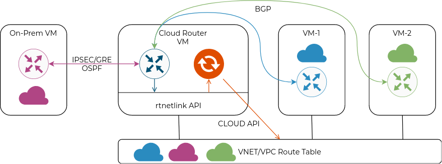

# cloudroutesync
An add-on for cloud-hosted routers that reads local routes via [rtnetlink](https://man7.org/linux/man-pages/man7/rtnetlink.7.html) and synchronizes them with a cloud routing table.



The main use cases are:

* Overlay-free self-managed Kuberentes clusters in the cloud - you can run BGP to establish reachability between PodCIDRs (e.g. KubeRouter, Calico)
* Multi/Hybrid cloud - sync local route table with subnets configured in a different environments (on-prem, another cloud).

> Note: The application relies on another routing daemon to program local netlink routes. This can be [FRR](http://docs.frrouting.org/en/latest/), [Quagga](https://www.nongnu.org/quagga/docs/quagga.html), [Bird](https://bird.network.cz/) or any other routing software suite.

## Currently Supported Clouds

* AWS
* Azure
* GCP*
* Openstack (maybe)

> Due to limitations of GCP's networking stack, the only supported mode is syncronization of routes received from outside of the local subnet. These routes will be set with nextHop of the router VM running cloudroutesync.

## Prerequisites

The application must be running on a cloud VM with enough IAM permissions to create/update cloud route table.

For example, in AWS this would require:

* Create/Delete RouteTable
* Associate/Deassociate RouteTables 
* Create/Delete Routes
* Create/Delete Tags
* Describe NetworkInterfaces and Instances

In addition to that, any VM that needs to send packets not natively known to the cloud SDN, need to have IP source check disabled.

See Terraform [directory](./terraform) for examples for:

* [AWS](./terraform/aws/main.tf)
* [Azure](./terraform/azure/main.tf)
* [GCP](./terraform/gcp/main.tf)

## Installation

To build a binary:

```
go get -v github.com/networkop/cloudroutesync
```

Alternatively, it is available as a docker image at `networkop/cloudroutesync`.

## Usage

```
Usage of cloudroutesync:
  -cloud string
    	public cloud providers [azure|aws|gcp]
  -debug
    	enable debug logging
  -event
    	enable event-based sync (default is periodic, controlled by 'sync')
  -netlink int
    	netlink polling interval in seconds (default 10)
  -sync int
    	cloud routing table sync interval in seconds (default 10)
```

It can run in two modes:

* Event-driven mode - cloud route table is only updated whenever there was a change detected in the netlink routing table. This mode is enabled with a `-event` flag.

* Periodic mode (default) - cloud route table is synced periodically based on the interval defined in the `-sync` flag.

## Demo

Demonstration can be done using any of the providers from the terraform [directory](./terraform).
Here we'll use AWS as an example.

1. Spin up a test environment with two VMs

```
cd ./terraform/aws
terraform init && terraform apply -auto-approve

```

3. SSH into both VMs and bring up the demo application.

Router VM will run both the FRR and the `cloudroutesync`:

```
router_ip=$(terraform output -json | jq -r '.public_address_router.value[0]')
ssh example@$router_ip
example@example-router-vm:~$ sudo CLOUD=aws docker-compose up -d
```

Second, non-router VM will run only the FRR container:

```
vm_ip=$(terraform output -json | jq -r '.public_address_vm.value[0]')
ssh example@$vm_ip
example@example-vm:~$ sudo docker-compose up -d frr
```

3. From a non-router VM and configure a BGP peering towards the cloud router

```
example@example-vm:~$ sudo docker-compose exec frr vtysh
conf
router bgp 
neighbor ROUTER-VM-PRIVATE-IP peer-group PEERS
```

4. From the same VM configure a new loopback IP and redistribute it into BGP

```
interface lo
ip address 198.51.100.100/32
!
router bgp 
redistribute connected
```


5. From a non-router VM start a ping towards router VM sourced from the new interface

```
ping ROUTER-VM-PRIVATE-IP -I 198.51.100.100
```

6. From a router VM observe the logs of the `cloudroutesync` service:

```
sudo docker-compose logs crs
crs_1  | level=info msg="Route change detected"
crs_1  | level=info msg="Syncing Route Table"
```

7. Observe how route table gets populated with the new prefix.

The ping from step #5 should now receive responses.
